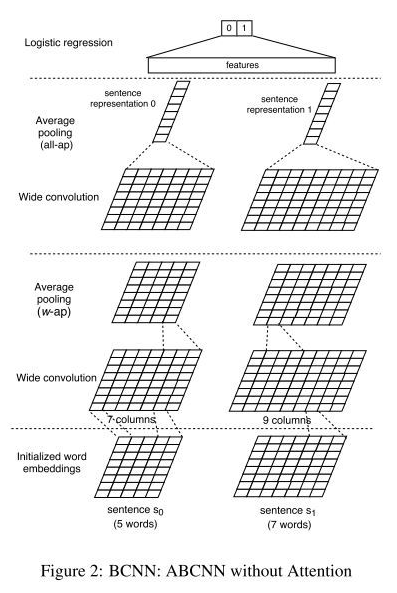
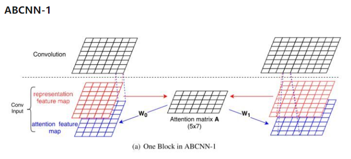
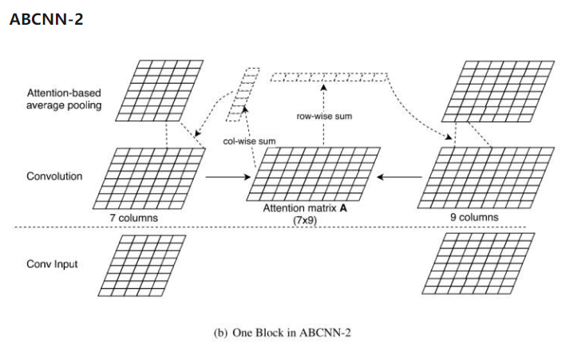

## ABCNN (ABCNN: Attention-Based Convolutional Neural Network for Modeling Sentence Pairs)

### 数据集：
#### LCQMC (http://icrc.hitsz.edu.cn/info/1037/1146.htm) 数据集有版权保护，本项目不提供，请自行下载或替换其他数据集进行试验

### 数据形式：
#### sentence_1 \t sentence_2 \t label

### 文件解释
* main.py —— 主文件
* model.py —— 模型结构
* config.py —— 配置参数
* Data_Generate.py —— 数据集处理脚本
* /data —— 数据存放文件夹
* /save_model —— 模型存储文件夹

### 模型结构

* BCNN的B代表Basic-Bi。它由四个部分组成：输入层(embedding)，卷积层(convolution)，池化层(pooling)，输出层(Logistic)

* ABCNN-1 通过对输入句子的向量表示进行attention操作，从而影响卷积网络，也即它的attention是在卷积操作之前进行的。

* ABCNN-2是对conv层的输出进行attention，从而对卷积层的输出结果进行加权。attention矩阵的计算方式与ABCNN-1相同，计算完attention矩阵之后，需要分别为两个句子计算它们的conv输出和attention矩阵Average Pooling(如上图中的两个虚线部分，它们中的每个元素分别代表了相应单词针对attention矩阵的行和列分别做Average Pooling的权重)的乘积。

* 理解完ABCNN-1和ABCNN-2，ABCNN-3就容易理解了，它就是将上面的两个结构进行叠加，结构如上。

### 参考资料
* ABCNN: Attention-Based Convolutional Neural Network for Modeling Sentence Pairs (https://arxiv.org/abs/1512.05193)
* https://zhuanlan.zhihu.com/p/50160263

