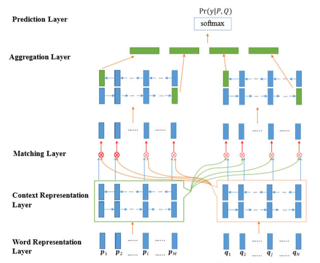

## BiMPM (Bilateral Multi-Perspective Matching for Natural Language Sentences)

### 数据集：
#### LCQMC (http://icrc.hitsz.edu.cn/info/1037/1146.htm) 数据集有版权保护，本项目不提供，请自行下载或替换其他数据集进行试验

### 数据形式：
#### sentence_1 \t sentence_2 \t label

### 文件解释
* main.py —— 主文件
* model.py —— 模型结构
* config.py —— 配置参数
* Data_Generate.py —— 数据集处理脚本
* /data —— 数据存放文件夹
* /save_model —— 模型存储文件夹

### 模型结构

* Our model essentially belongs to the“matching-aggregation”framework. Given two sentences P and Q, our model first encodes them with a bidirectional Long Short-Term Memory Network (BiLSTM). Next, we match the two encoded sentences in two directions P→Q and P←Q. In each matching direction, let’s say P→Q, each time step of Q is matched against all time-steps of P from multiple perspectives.
* BiMPM这个模型最大的创新点在于采用了双向多角度匹配，不单单只考虑一个维度，采用了matching-aggregation的结构，把两个句子之间的单元做了四种相似度计算，最后经过全连接层与softamx层得到最终的结果，不过这也成了其缺点，慢。
* 考虑局部推断和全局推断

### 参考资料
* Bilateral Multi-Perspective Matching for Natural Language Sentences (https://arxiv.org/abs/1702.03814)
* https://zhuanlan.zhihu.com/p/50184415

