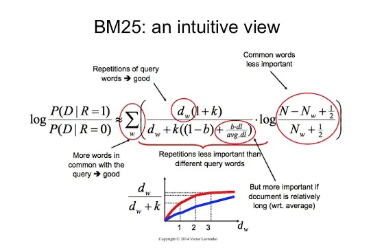

## BM25

### 概述
BM25算法，通常用来作搜索相关性评分。一句话概况其主要思想：对Query进行语素解析，生成语素qi；然后，对于每个搜索结果D，计算每个语素qi与D的相关性得分，最后，将qi相对于D的相关性得分进行加权求和，从而得到Query与D的相关性得分。

### 数学公式

### 文件解释
* BM25.py —— 主文件
* /data —— 数据存放文件夹

### 参考资料
* https://www.jianshu.com/p/1e498888f505

