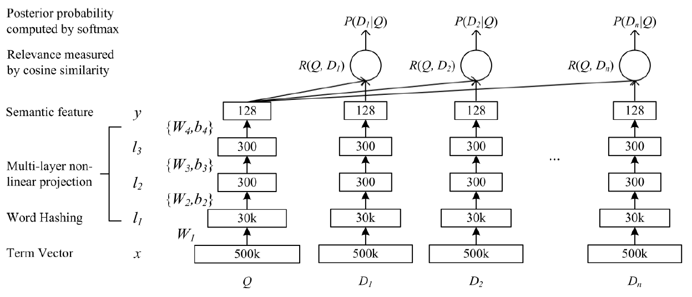

## DSSM (Learning Deep Structured Semantic Models for Web Search using Clickthrough Data)

### 数据集：
#### LCQMC (http://icrc.hitsz.edu.cn/info/1037/1146.htm) 数据集版权保护，本项目不提供，请自行下载或替换其他数据集进行试验

### 数据形式：
#### query \t pos \t neg_1 \t neg_2 \t neg_3 \t neg_4
    其中pos为正例，neg_1、neg_2、neg_3、neg_4为随机负采样得到负例

### 文件解释
* main.py —— 主文件
* model.py —— 模型结构
* config.py —— 配置参数
* Data_Generate.py —— 数据集处理脚本
* /data —— 数据存放文件夹
* /save_model —— 模型存储文件夹

### 模型结构

* DSSM的原理很简单，通过搜索引擎里Query和Title的海量的点击曝光日志，用DNN把Query和Title表达为低纬语义向量，并通过cosine距离来计算两个语义向量的距离，最终训练出语义相似度模型。该模型既可以用来预测两个句子的语义相似度，又可以获得某句子的低纬语义向量表达。
* DSSM 从下往上可以分为三层结构：输入层、表示层、匹配层

### 参考资料
* Learning Deep Structured Semantic Models for Web Search using Clickthrough Data (https://www.microsoft.com/en-us/research/publication/learning-deep-structured-semantic-models-for-web-search-using-clickthrough-data/)
* https://blog.csdn.net/wangqingbaidu/article/details/79286038

