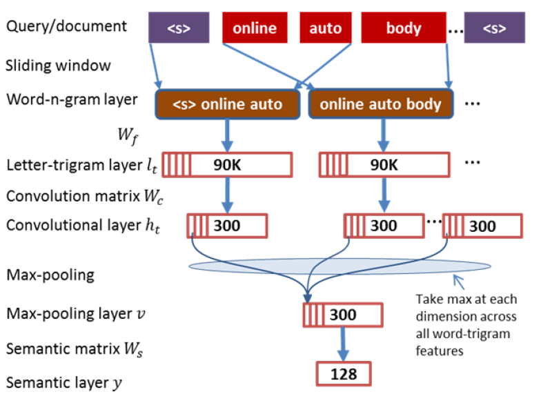

## DSSM-CNN (CLSM: A Latent Semantic Model with Convolutional-Pooling Structure for Information Retrieval)

### 数据集：
#### LCQMC (http://icrc.hitsz.edu.cn/info/1037/1146.htm) 数据集版权保护，本项目不提供，请自行下载或替换其他数据集进行试验

### 数据形式：
#### query \t pos \t neg_1 \t neg_2 \t neg_3 \t neg_4
    其中pos为正例，neg_1、neg_2、neg_3、neg_4为随机负采样得到负例

### 文件解释
* main.py —— 主文件
* model.py —— 模型结构
* config.py —— 配置参数
* Data_Generate.py —— 数据集处理脚本
* /data —— 数据存放文件夹
* /save_model —— 模型存储文件夹

### 模型结构

* 原始的DSSM中所有单词相当于是独立来看的，而且Query和Doc都是Bag of words，句子之间的联系就被词袋模型给忽视掉了，所以作者通过引入卷积操作，尽量地捕捉单词的相关性。
* 模型的主要思想是使用CNN结构来提取语料的语义信息，卷积层的使用保留了词语的上下文信息，池化层的使用提取了对各个隐含语义贡献最大的词汇。
* DSSM-CNN与DSSM的区别主要在于输入层和表示层。

### 参考资料
* A Latent Semantic Model with Convolutional-Pooling Structure for Information Retrieval (http://www.iro.umontreal.ca/~lisa/pointeurs/ir0895-he-2.pdf)
* https://www.cnblogs.com/wmx24/p/10157154.html

