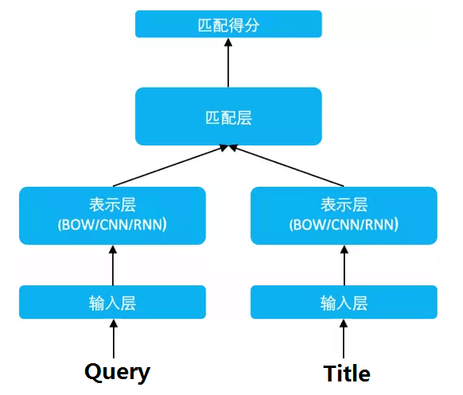

## DSSM-Embedding

### 数据集：
#### LCQMC (http://icrc.hitsz.edu.cn/info/1037/1146.htm) 数据集版权保护，本项目不提供，请自行下载或替换其他数据集进行试验

### 数据形式：
#### query \t pos \t neg_1 \t neg_2 \t neg_3 \t neg_4
    其中pos为正例，neg_1、neg_2、neg_3、neg_4为随机负采样得到负例

### 文件解释
* main.py —— 主文件
* model.py —— 模型结构
* config.py —— 配置参数
* Data_Generate.py —— 数据集处理脚本
* /data —— 数据存放文件夹
* /save_model —— 模型存储文件夹

### 模型结构

* 本模型是对DSSM的改进，主要将BOW表示层替换为Embedding层，减小词汇表征维度。

### 参考资料
* https://www.cnblogs.com/guoyaohua/p/9229190.html

