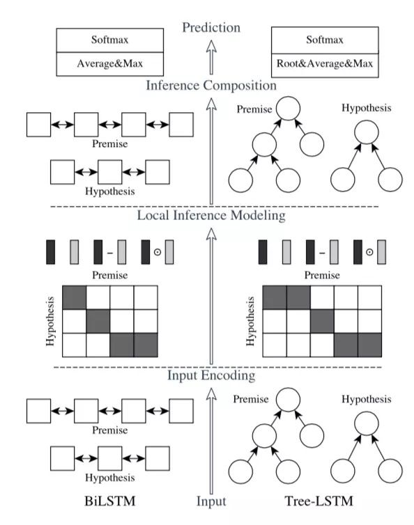

## ESIM (Enhanced LSTM for Natural Language Inference)

### 数据集：
#### LCQMC (http://icrc.hitsz.edu.cn/info/1037/1146.htm) 数据集有版权保护，本项目不提供，请自行下载或替换其他数据集进行试验

### 数据形式：
#### sentence_1 \t sentence_2 \t label

### 文件解释
* main.py —— 主文件
* model.py —— 模型结构
* config.py —— 配置参数
* Data_Generate.py —— 数据集处理脚本
* /data —— 数据存放文件夹
* /save_model —— 模型存储文件夹

### 模型结构

* Unlike the previous top models that use very complicated network architectures, we first demonstrate that carefully designing sequential inference models based on chain LSTMs can outperform all previous models. Based on this, we further show that by explicitly considering recursive architectures in both local inference modeling and inference composition, we achieve additional improvement.
* ESIM主要分为三部分：input encoding，local inference modeling 和 inference composition
* 精细的设计序列式的推断结构
* 考虑局部推断和全局推断

### 参考资料
* Enhanced LSTM for Natural Language Inference (https://arxiv.org/abs/1609.06038)
* https://zhuanlan.zhihu.com/p/47580077

