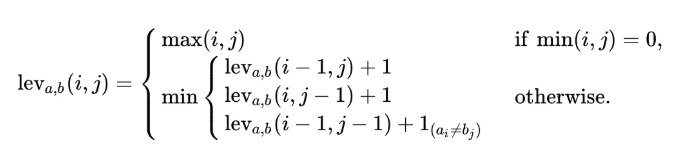

## Edit_Distance (Levenshtein Distance)

### 概述
编辑距离（Minimum Edit Distance，MED），由俄罗斯科学家 Vladimir Levenshtein 在1965年提出，也因此而得名 Levenshtein Distance。

在信息论、语言学和计算机科学领域，Levenshtein Distance 是用来度量两个序列相似程度的指标。通俗地来讲，编辑距离指的是在两个单词之间，由其中一个单词转换为另一个单词所需要的最少单字符编辑操作次数。

在这里定义的单字符编辑操作有且仅有三种：

* 插入（Insertion）
* 删除（Deletion）
* 替换（Substitution）

#####譬如，"kitten" 和 "sitting" 这两个单词，由 "kitten" 转换为 "sitting" 需要的最少单字符编辑操作有：

* kitten → sitten (substitution of "s" for "k")
* sitten → sittin (substitution of "i" for "e")
* sittin → sitting (insertion of "g" at the end)

因此，"kitten" 和 "sitting" 这两个单词之间的编辑距离为 3 

### 数学公式

### 文件解释
* edit_distance.py —— 主文件
* /data —— 数据存放文件夹

### 参考资料
* https://www.jianshu.com/p/a617d20162cf

