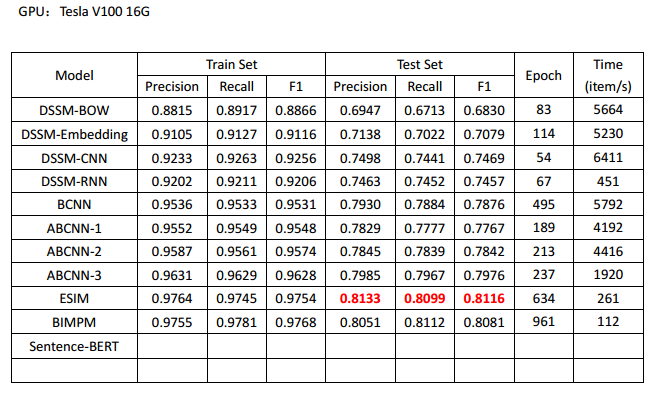

# Text Matching Based on LCQMC: A Large-scale Chinese Question Matching Corpus

### 模型
* ABCNN
* BIMPM
* DSSM-BOW
* DSSM-CNN
* DSSM-RNN
* DSSM-Embedding
* ESIM
* BM25
* Edit-Distance
* Jaccard

### 数据集：
#### LCQMC (http://icrc.hitsz.edu.cn/info/1037/1146.htm) 数据集版权保护，本项目不提供，请自行下载或替换其他数据集进行试验

### 数据形式：
#### sentence_1 \t sentence_2 \t label

### 依赖环境
    Python 3.6
    TensorFlow 1.15

### 模型对比：

* 以上结果只是对模型做了基本测试与验证、参数也不一定是最优，如果需用在具体项目中，可自行调试。

